# Architecture overview

This document describes the system architecture of `osn-informatika-2026`:
what the four layers are, how a curriculum fact moves through them, the
rules that keep the dependency graph one-way, and what this repository
deliberately does not attempt to be.

It is written against the repository as it exists at release v1.0.0
(issues #1-#25 complete; issue #26, the release itself, in progress):
`src/schema/`, `src/domain/`, `src/cli/`, `src/render/`, and `data/` all
carry their full, real content. See `repository-map.md` for the
exhaustive directory-by-directory version of the same description.

## System overview: four layers, one direction

The system is four layers, each depending only on the layer(s) to its
left:

```
data/*.json  --->  src/schema/  --->  src/domain/  --->  src/render/
                                                     `->  src/cli/
```

1. **`data/*.json`** — the curriculum corpus itself: inert JSON files with
   no executable logic. 22 files today (topic families, weeks, gates,
   references, assessment model, KPI definitions, playbooks, and more).
2. **`src/schema/`** — Zod schemas that are the single source of truth for
   both runtime validation and the static TypeScript types inferred from
   them (see ADR-0003). A schema describes the shape a data file must have
   and rejects anything that doesn't match it, with a readable error.
3. **`src/domain/`** — typed queries and business rules that operate on
   data that has already been parsed through a schema. Domain code never
   re-validates its input; it assumes validity because loading always goes
   through the schema layer first (see "Layering rules" below).
4. **`src/render/`** and **`src/cli/`** — the two output-facing modules
   that consume the domain layer:
   - `src/render/` turns domain data into mentor-facing artefacts
     (Markdown session plans, checkpoint sheets, SOP cards, the cohort
     readiness checklist).
   - `src/cli/` is the `osn` command-line entrypoint that wires
     subcommands (`validate`, `plan`, `render`, `report`, `privacy-check`,
     `checklist`) to the domain and render layers, dispatching without an
     external CLI framework (TR-11).

`src/index.ts` is the package entrypoint, built by `bun run build` into
`dist/`.

## Component diagram

```mermaid
flowchart LR
    subgraph Source["Source document"]
        PDF["Silabus PDF\n(docs/*.pdf)"]
    end

    subgraph Corpus["docs/silabus/ (Markdown corpus)"]
        MD["Structured Markdown\n01-*.md .. 14-*.md, 99-referensi.md"]
    end

    subgraph Data["data/ — inert JSON"]
        JSON["data/*.json\n(topic families, weeks, gates,\nreferences, records, ...)"]
    end

    subgraph Schema["src/schema/ — Zod contracts"]
        ZOD["Zod schemas\n(runtime validation + static types)"]
    end

    subgraph Domain["src/domain/ — typed queries & rules"]
        DOM["Loaders, lookups,\nbusiness rules"]
    end

    subgraph Output["src/render/ + src/cli/"]
        REND["Render:\nweekly / checkpoint / SOP / checklist\nMarkdown artefacts"]
        CLI["CLI:\nosn validate / plan / render / report /\nprivacy-check / checklist"]
    end

    PDF -- "manual transcription" --> MD
    MD -- "manual transcription" --> JSON
    JSON -- "parsed at load, once" --> ZOD
    ZOD -- "validated, typed data" --> DOM
    DOM --> REND
    DOM --> CLI
    CLI -- "invokes" --> REND
```



## Data flow narrative

A single curriculum fact — for example, the phase gate after week 12 in
§4.1 — travels through the pipeline like this:

1. **Source PDF**
   (`docs/Silabus_Operasional_OSN_Informatika_2026_Siap_Pakai_AhliKoding_AhliWeb.pdf`)
   is the authoritative document. It is never parsed programmatically at
   runtime; it is read by a human.
2. **`docs/silabus/04-silabus-28-minggu.md`** is the
   faithful Markdown transcription of that section, preserving the
   original structure, tables, and citation markers (`Rnn`) — see TR-10 in
   `docs/requirements/register.md`.
3. **`data/gates.json`** is the machine-readable
   encoding of the same fact: which week the gate follows, its minimum
   evidence text, and its `blocksProgression` flag. This file is
   hand-authored against the Markdown in step 2, not generated from it —
   there is no PDF-to-JSON or Markdown-to-JSON automation in this
   repository.
4. **`src/schema/gate.ts`** defines the Zod
   shape that file must satisfy. Loading the file always means parsing it
   through this schema; a gate record missing its evidence text or with a
   duplicate week number is rejected at load time with a readable error,
   not discovered later as a rendering bug.
5. **`src/domain/curriculum.ts`** exposes the validated gate records as
   typed queries (`listGates()`, `gateAfter(week)`) — for example, "the
   gate that blocks progression past week 12" — without re-checking
   anything the schema already guaranteed.
6. **`src/render/checkpoint.ts`** turns that domain
   query into a rendered mentor artefact: a Markdown checkpoint sheet
   listing the week-12 gate's evidence requirement, invoked via `osn
   render checkpoint` (`src/cli/`).

The same shape of pipeline applies to every other curriculum fact (topic
families, weekly sessions, assessment weights, KPI definitions, decision
playbooks, and so on) — only the specific schema, domain module, and
render target differ. See `docs/requirements/register.md` and
`docs/requirements/traceability.md` for the full section-by-section list
of which issue built which piece of this pipeline.

## Layering rules

These are constraints on the dependency graph, not just a description of
today's directory layout — they hold for every issue that lands code
under `src/` or `data/`:

- **`data/*.json` is inert.** Data files contain no executable logic, no
  computed fields, no references to code. They are plain JSON, hand-
  authored and reviewed like any other source file.
- **`src/schema/` never imports `src/domain/`.** Schemas describe shape
  and constraints only; they have no knowledge of the queries or rules
  that will later run over validated data.
- **`src/domain/` never imports `src/cli/` or `src/render/`.** Domain
  logic is presentation-agnostic — it has no knowledge of Markdown
  rendering or command-line argument parsing. This is what makes the same
  domain query reusable from both `osn render` and `osn report`.
- **Validation happens at load, once.** Parsing a `data/*.json` file
  through its Zod schema is the single point where invalid data is
  rejected. Every module downstream of that parse call (`src/domain/`,
  `src/render/`, `src/cli/`) may assume the data it receives is valid and
  must not re-implement validation logic of its own.
- **Dependencies only point left-to-right** in the diagram above:
  `render`/`cli` may depend on `domain`, `domain` may depend on `schema`
  and on parsed `data`, and nothing depends back on something to its
  right. A domain module importing from `src/cli/` or `src/render/`, or a
  schema importing from `src/domain/`, is an architecture violation
  regardless of how convenient it looks locally.

## Out of scope

This repository is curriculum-as-code, not a learning platform. The
following are explicitly **not** built here, per the non-affiliation
notice and "What this repository is not" section in `README.md`, and per
ADR-0001:

- **No judge/grader.** Nothing here compiles, runs, or scores submitted
  source code. `osn report` computes KPIs from
  already-produced learning-record data; it does not produce that data by
  executing anyone's submission.
- **No LMS.** Nothing here delivers lessons, enrols learners, manages
  cohorts, or provides a learner-facing UI. `osn plan`
  generates a calendar as data/Markdown; it is not a scheduling system
  with users and notifications.
- **No authentication or authorization.** There are no accounts, no
  sessions, no roles enforced at runtime. Role-based access is a policy
  this repository *describes* (`docs/governance/privacy.md`) for a
  downstream platform to *implement*.
- **No database.** The corpus lives in version-controlled JSON files,
  read from disk. There is no persistence layer, no migrations, no query
  engine beyond in-memory domain functions over parsed JSON.
- **No network I/O at runtime.** Schema validation, domain queries,
  rendering, and CLI commands all run against local files. Nothing in
  `src/` makes an HTTP request, and `osn validate`'s referential-integrity
  check (TR-08) is explicitly a "network-free integration
  test" per FR-13.
- **No student personal data.** This repository defines schemas for
  learning records and problem taxonomy but never stores
  real learner data — see ADR-0004.

**What a consumer must build themselves:** the actual LMS/dashboard UI,
the judge/execution sandbox, authentication and session management, a
database and its operational concerns (backup, migration, scaling),
network APIs, and the runtime enforcement of the role-based access model
this repository only describes.

**What this repository guarantees instead:** a validated, versioned,
typed definition of *what* the curriculum, its pedagogy, its assessment
model, and its data shapes are — so that whoever builds the platform above
does not have to reverse-engineer the syllabus themselves, and so that the
data they build against is internally consistent (see "Guarantees"
below).

## Guarantees

- **Deterministic output.** Given the same corpus and the same inputs,
  generators produce byte-identical output. This is stated as an explicit
  requirement for the calendar generator (TR-07, `osn plan`:
  "byte-identical output across repeated runs ... computed with UTC
  date arithmetic only") and is the general expectation for every render
  target in `src/render/`, since they are pure functions from validated
  data to a string (FR-24).
- **Referential integrity across the corpus.** Every cross-reference
  inside `data/` — a week's topic-family reference, a citation's `Rnn`
  reference, a stage's assessment-bank reference — resolves to a record
  that actually exists, enforced mechanically rather than by convention
  (FR-05, FR-13, TR-08; enforced by `osn validate`).
- **Every curriculum fact is traceable to a syllabus section.** Every
  requirement in `docs/requirements/register.md` cites the exact
  `docs/silabus/*.md` section (and, transitively, the source PDF) it
  comes from, and `docs/requirements/traceability.md` proves that mapping
  is exhaustive in both directions (every syllabus section maps to at
  least one requirement, and every requirement maps to at least one
  issue). Nothing in `data/` is expected to encode a fact that cannot be
  pointed back to a specific `sourceSection` in the syllabus corpus.

## Further reading

- `docs/architecture/repository-map.md` — directory-by-directory detail.
- `docs/architecture/adr/` — the decisions behind this shape, with
  rejected alternatives.
- `docs/requirements/register.md` and `docs/requirements/traceability.md`
  — the full requirement-to-issue mapping this overview summarises.
- `docs/development/testing.md`, `docs/development/ci-cd.md`,
  `docs/development/releasing.md` — how the layering rules above are
  enforced mechanically (coverage gate, CI steps, versioning policy).
